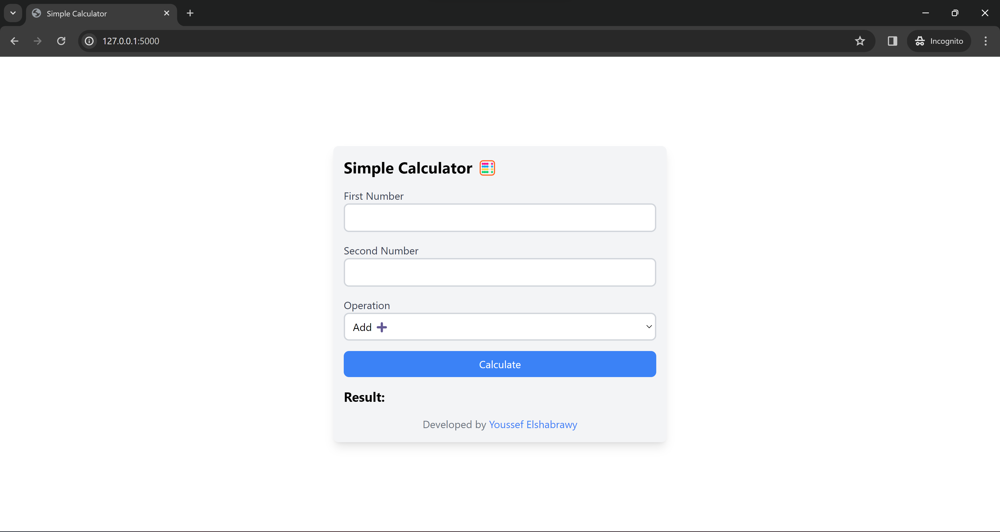
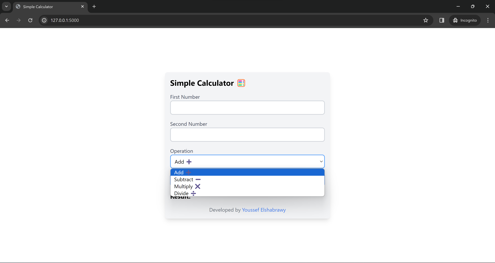
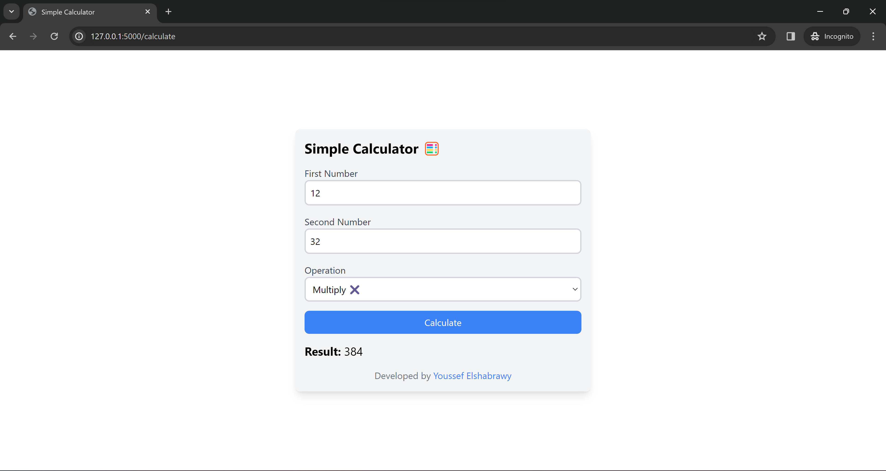
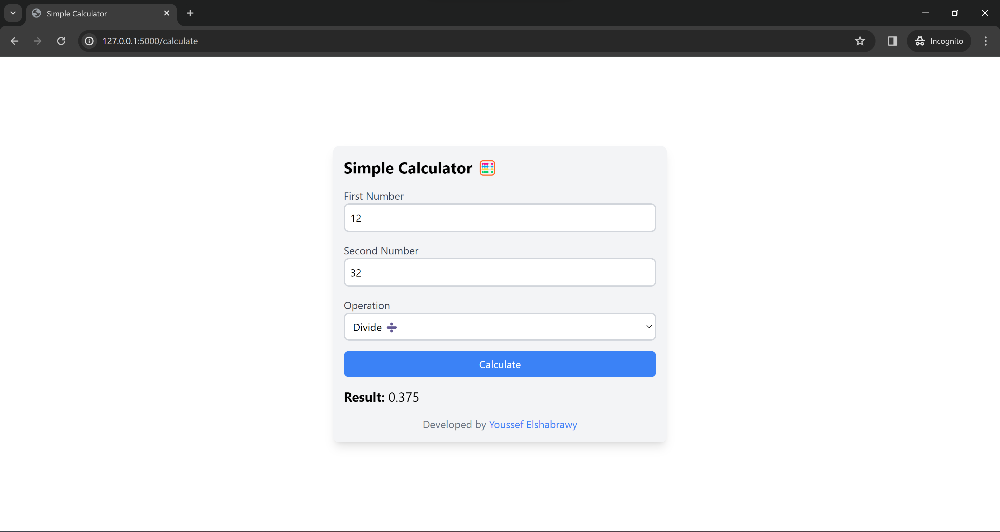
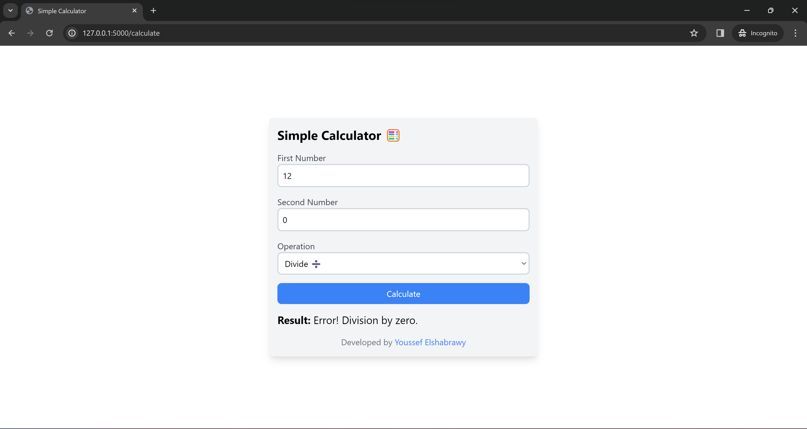

# Simple Flask Calculator
## Demo Video

## Description
This is a simple calculator web application built with Flask. It allows users to perform basic arithmetic operations such as addition, subtraction, multiplication, and division.

> The styling is done using TailwindCSS

## Screenshots

<figure>

<figcaption>Main UI</figcaption>
</figure>

<figure>

<figcaption>List of operators</figcaption>
</figure>

<figure>

<figcaption>Addition</figcaption>
</figure>

<figure>

<figcaption>Subtraction</figcaption>
</figure>

<figure>

<figcaption>Multiplication</figcaption>
</figure>

<figure>

<figcaption>Division</figcaption>
</figure>

<figure>

<figcaption>Error Handling</figcaption>
</figure>
